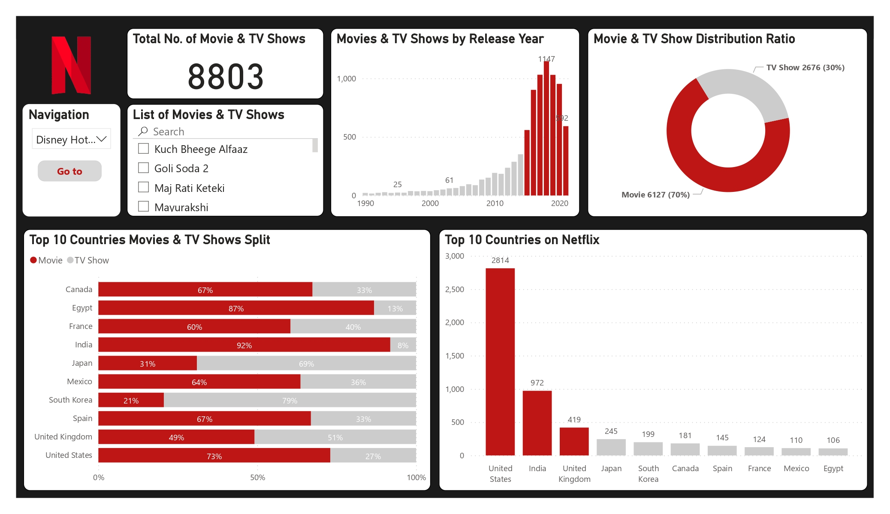
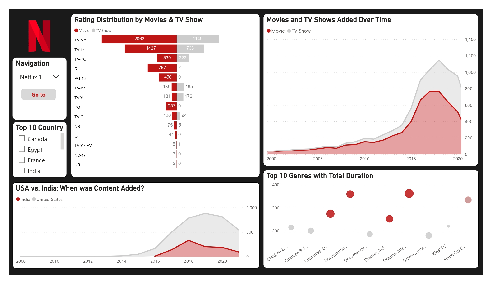
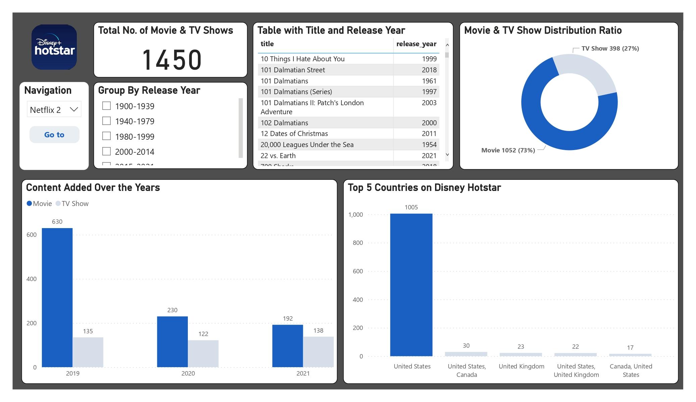
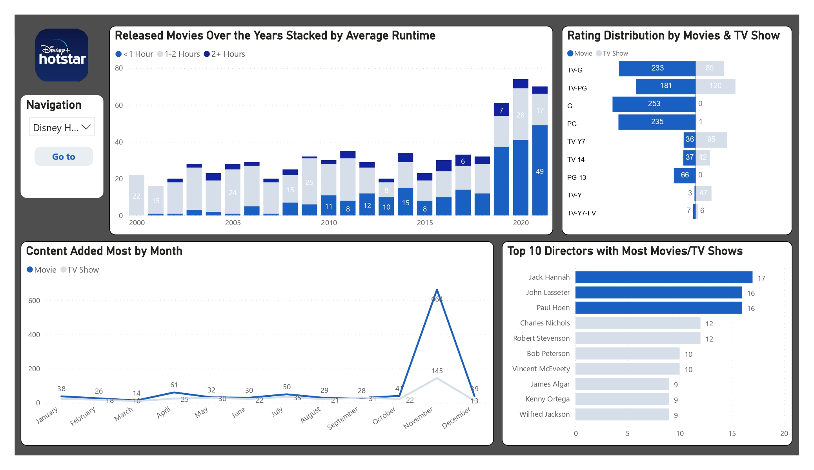

# [Project 1: Indian Startup Ecosystem Exploratory Data Analysis](https://github.com/VivekPratapSingh70/Netflix-Disney-Analysis)
# [Project 2: Netflix-Disney Exploratory Data Analysis](https://github.com/VivekPratapSingh70/Netflix-Disney-Analysis)

This is a project where I did exploratory analysis on Netflix and Hotstar dataset.

- Data was taken from Kaggle.com, links for both dataset are below:
  - [Netflix Movies and TV Shows](https://www.kaggle.com/datasets/shivamb/netflix-shows)
  - [Disney+ Movies and TV Shows](https://www.kaggle.com/datasets/shivamb/disney-movies-and-tv-shows)
- Different Power BI tools were used to analyse length of movies/TV shows on both platforms and there correlation to amount of content.
- Other analysis were on content added over the years and amount of content as per rating.
## Overview of the Netflix analysis Dashboard

## Overview of the Disney analysis Dashboard

